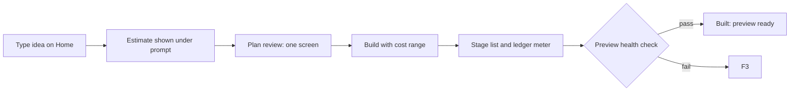
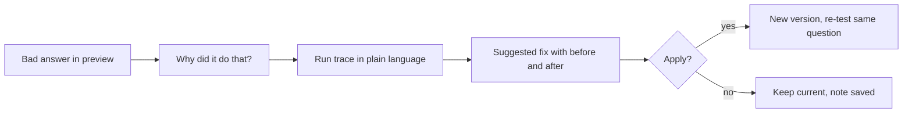

# 06. User flows

Every flow uses screen numbers from the [screen inventory](design/screen-inventory.md) and the demo project from [content and seed data](design/content-and-seed-data.md). Persona A is the business builder, persona B the developer.

## Coverage

| Flow | Required feature | Persona | Priority |
|---|---|---|---|
| F1 First run | Authentication | Both | P0 |
| F2 Prompt to live preview | Homepage, Chat window, UI getting built, App preview | A | P0 |
| F3 A build goes wrong | UI getting built | Both | P0 |
| F4 Why did it do that? | Agent section | A, then B | P0 |
| F5 Inspect and add agents | Agent section | B | P0 |
| F6 Review changes in code | Beyond list | B | P0 |
| F7 Import an existing repo | Beyond list | B | P0 |
| F8 Connect GitHub | GitHub integration | Both | P0 |
| F9 Deploy, promote, roll back | Deploying the app | Both | P0 |
| F10 Control spend | Beyond list | Both | P1 |
| F11 Check in from a phone | All | Both | P1 |

---

## F1 First run
1. Landing (1): reads the thesis, picks **Sign in** or **Try the demo**.
2. Try the demo opens the seeded project (22) read-only, no account needed. A banner offers sign in to build your own.
3. Sign in (2): Google, one click. Works before the page finishes loading.
4. Onboarding (3): "How do you like to build?" with two answers: "Describe it and let Architect handle the details" (guided default) or "Show me the code and config" (details default). One screen, skippable, changeable later in Settings.
5. Home (4), empty state: prompt box focused, three starter templates, "Import a repo" link.

**Success:** a new user reaches a focused prompt box in under 30 s, or a reviewer reaches a working demo with zero sign-in.

## F2 Prompt to live preview (persona A)

1. Home (4): types the idea. Under the prompt: "First build for this kind of app: about 6 to 10 min, $1.20 to $2.00."
2. Plan review (5): one screen replaces today's three gates. Left: 3 clarifying questions with sensible defaults already selected. Right: the plan in plain language (what users can do, which agents, which screens). Details reveals the full PRD.
3. **Build** button shows the range again and the cap: "Build, $1.20 to $2.00 of your $5 cap."
4. Workspace (6, 7): stage list resolves in order (Plan, Database, Agents, Interface, Checks). Each stage shows elapsed time and cost so far. The conversation narrates in one line per step.
5. Preview health check runs before anything says "done".
6. Built: preview (8) loads with the app running. Ledger bar: "Preview v1 | Not deployed | Built just now | $1.46 of $5 cap".

**Success:** the builder never waits without a named stage, and the final cost lands inside the estimate range.

## F3 A build goes wrong
1. During Interface, a check fails. The stage turns `fault` with a plain cause: "A page could not load because a package is missing."
2. Architect retries automatically once. If the same failure repeats 3 times, it stops: "Stopped after 3 identical failures. No further credits used." A failed build is charged $0.00, and the screen shows what the finished stages used beside that rule, in the same words Deploy uses.
3. Actions: **Try a different approach** (shows new estimate) or **Details** (persona B sees the error log and the failing file). No rollback is offered: this is the first build, so there is nothing behind it, and a rollback only ever targets a version that was in production ([D59](07-decision-log.md#d59-2026-09-26-a-rollback-goes-back-to-something-that-was-live)).
4. A stale preview is never shown as current: if the preview is out of date, it says so and offers **Refresh preview**.

## F4 Why did it do that? (signature flow)

1. In the preview (8), the builder tests: "When will my credit be applied?" The app escalates to a human instead of answering.
2. Hover or tap the answer, then **Why did it do that?** (10).
3. Plain-language trace: "The Answer agent wrote *at the start of your next billing cycle*. The help article only says *at the next billing cycle*. The Grounding Checker flagged the extra detail and escalated, which is the safe behavior."
4. Suggested fix: "Make the Answer agent stay closer to the source wording." Shows before and after answers for the same question and the cost of re-testing.
5. **Apply fix** creates v15 in preview and re-runs the question 5 times, showing 5 of 5 grounded.
6. Persona B opens **Details**: the same trace shows each agent's input and output, retrieval scores, and the actual change as a diff: `temperature: 0.4 -> 0.2` plus one added instruction line.

**Success:** a non-technical builder fixes a real reliability issue without leaving Architect and without knowing the word "temperature". Nothing is applied silently.

## F5 Inspect and add agents (persona B)
1. Agents tab (9): the network drawn on the blueprint grid. Tap an agent to open the inspector.
2. Inspector, guided view: role, knowledge sources, tools, and a "Precise to creative" slider.
3. **Details**: the agent as a config file (mono), with model, parameters, and version history. Edits create a diff and a new version.
4. **Test this agent** runs it alone with a sample input.
5. **Add agent** (11): framework picker with Lyzr, GitAgent, LangGraph, CrewAI, OpenAI Agents SDK. Each shows what Architect can and cannot manage for it.

## F6 Review changes in code (persona B)
1. Code tab (12): file tree, editor, and a **Changes** list grouped by request ("Add escalation reason to dashboard: 3 files").
2. Open a change: side-by-side diff. **Accept** or **Revert** per file or per request.
3. Terminal and logs share the bottom panel. Checks shows type check, lint, and preview health results like CI.
4. Every accepted change is a commit visible in Deploy (16) and on GitHub if connected.

## F7 Import an existing repo (persona B)
1. Home (4) or Import (15): pick repo, branch (the default branch, correctly detected), optional subfolder.
2. Compatibility report before anything runs: detected framework, support level (Full, Partial, Not supported), what Architect will add or change, and the estimate.
3. Partial or not supported is said plainly, with what still works: "Flask detected. Architect can add agents and a new UI, but will not modify your Python routes."
4. **Import** only after the report. Nothing is charged before.

## F8 Connect GitHub
1. From the workspace header or Deploy (16): **Connect GitHub** opens the consent sheet (14).
2. Choose **New repo** or **Existing repo**, visibility (private by default), and sync direction (two-way by default).
3. The sheet lists exactly what will be written: "Create private repo northwind-helpline, push 42 files, 1 commit." Nothing is written until **Connect and push**.
4. After connecting: commits made in your editor appear in Architect's version list; Architect's changes appear as commits you can review.

## F9 Deploy, promote, roll back
1. Deploy tab (16) shows two environments: Preview (v14) and Production (v12, live).
2. **Deploy to production**: sheet shows what changes between v12 and v14, checks status, domain, and publish settings. Marketplace is off by default, with a note on who pays for usage if turned on.
3. Access settings: who can use the app, and admin invites by email (replaces today's environment variable).
4. Deployed: ledger bar updates to "Production v14 live".
5. **Roll back** from the version list: pick v12, see what reverts, confirm. Live in one step.

## F10 Control spend
1. Ledger bar spend opens Usage (17): spend per project and per stage, estimate versus actual for each build.
2. Set a monthly cap. When a build's upper estimate would cross the cap, the Build button says so before running.

## F11 Check in from a phone
1. Home on a phone: recent projects as a list with each one's build and live status.
2. Open a project: Chat pane by default, Canvas one tap away via the bottom tab bar.
3. Review a pending change in Code (read-only on phone) and **Accept** it, or check what is live and **Roll back**.
